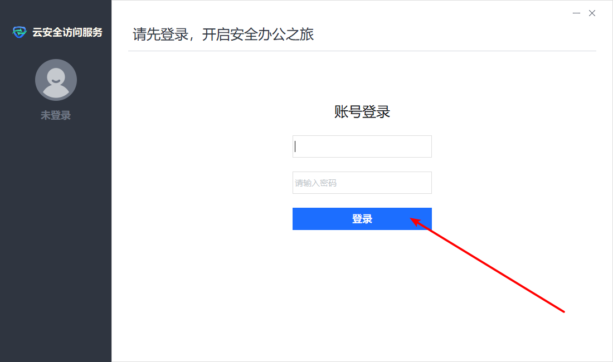
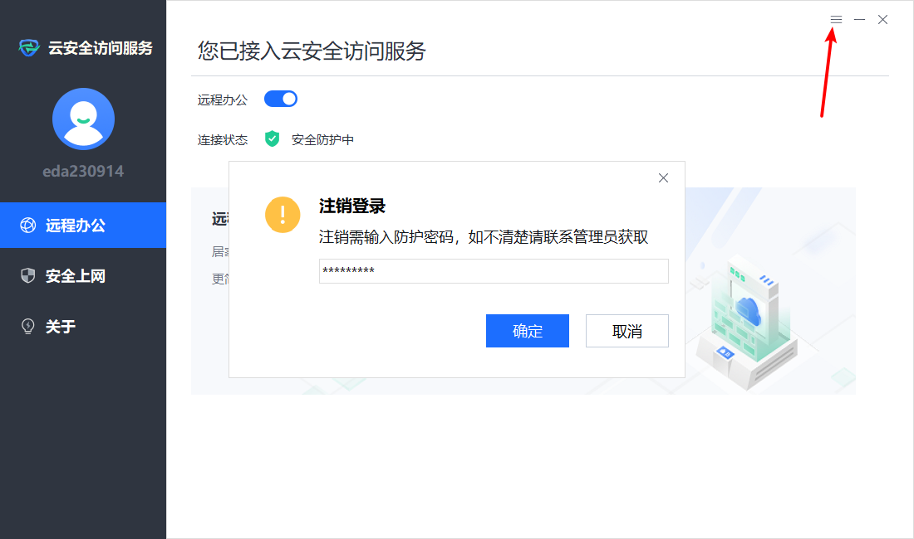

## 登录流程

### 1、下载网关

http://www.edachallenge.cn

### 2、SSH登录

#### （1）打开网关客户端

账号：eda230914

密码：hK62cRkL

#### （2）使用SSH客户端访问服务器

~~~shell
ssh -p22 eda230914@s9.edachallenge.cn
# password: edasampling
~~~

## 退出流程

### 1、退出网关

注销密码：admin@123
